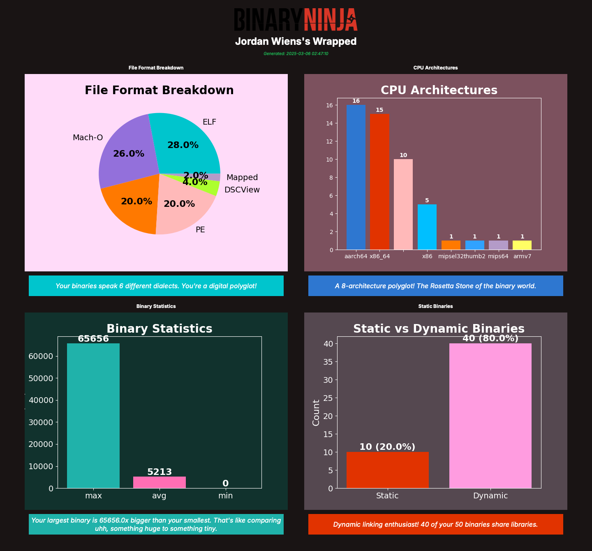

# Binary Ninja Wrapped

A fun "Spotify Wrapped" style visualization tool for your Binary Ninja usage.


## Overview

Binary Ninja Wrapped provides a stylish visualization of your reverse engineering habits in Binary Ninja. Inspired by Spotify's annual "Wrapped" feature, it analyzes your recently opened files and generates personalized stats and charts about:

- File format distribution (PE, ELF, Mach-O, etc.)
- CPU architecture preferences
- Binary size statistics
- Static vs. dynamic linking patterns

Each chart comes with personalized, sometimes humorous commentary on your binary analysis habits.

## Features

- **Interactive UI**: Browse different stats through an intuitive tabbed interface
- **Dynamic Visualizations**: Colorful charts and graphs display your binary analysis patterns
- **Personalized Quotes**: Each section features unique, context-aware commentary
- **Exportable Results**: Save a beautiful collage of all your charts in a grid layout

## Installation

1. Install via the Plugin Manager! 
1. Alternatively, clone this repository into your Binary Ninja plugins directory:
   ```
   cd ~/.binaryninja/plugins/  # Linux/macOS
   # or
   cd %APPDATA%\Binary Ninja\plugins\  # Windows
   git clone https://github.com/vector35/bnwrap.git
   ```

1. Restart Binary Ninja.

## Usage

1. Open Binary Ninja
2. Go to the **Plugins** menu
3. Select **Binja Wrapped**
4. Browse through the tabs to explore different aspects of your binary analysis habits
5. Use the **Export Combined Image** button to save a shareable collage

## Example



## Requirements

- Binary Ninja (recent version)
- PySide6 (included with Binary Ninja)

## Contributing

Contributions are welcome! Feel free to submit pull requests or open issues for bugs or feature requests.

## License

This project is released under the MIT License. See the LICENSE file for details.